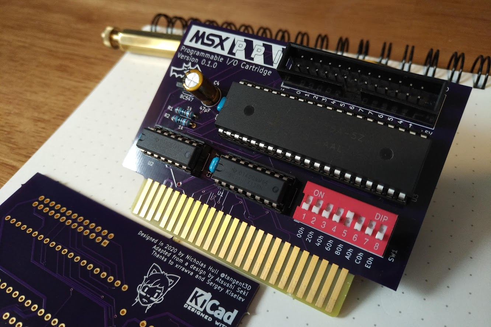

### MSX-PPI
MSX-PPI is an MSX compatible programmable I/O cartridge design based around the i8255 Programmable Peripheral Interface (PPI) offering the user 24 I/O pins (as three 8-bit ports) through the MSX cartridge slot.

### Thanks
@skiselev for his advice
[xrrawva](http://xrrawva.com/ "xrrawva") for bat graphics and support
@apoloval for MSX EEPROM cartridge PCB (used for 02x25 cartridge pins)
Atsushi Seki. "Putting Together a Standard Interface Board" *MSX Magazine*, Jul. 1990, pp. 128-131.

###Disclaimer
This is my first PCB design and may contain errors. Please do not hold me responsible for any damage to your system.